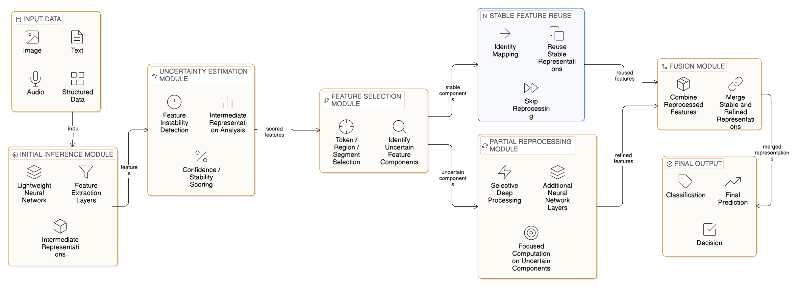

# Adaptive Inference using Selective Feature Reprocessing

## Overview

This project demonstrates an adaptive machine learning inference pipeline for
text classification.

Instead of processing every part of every input with the same level of
computation, the system first runs a lightweight model over the full sentence,
estimates token-level uncertainty, and sends only uncertain components to a
more expressive model. The final prediction is produced by combining the
first-pass and selective second-pass outputs.

The motivation is practical:

- reduce redundant computation
- improve inference efficiency
- demonstrate selective computation in a simple, inspectable system

This repository is a technical demo of adaptive computation, not a
production-accuracy benchmark.

## Key Innovation

Traditional AI inference pipelines often apply the same computational budget to
every token or feature in an input. That is simple, but it is also wasteful
when most of the input is easy to classify.

This project demonstrates a different pattern:

1. A lightweight model processes the full input.
2. The system measures uncertainty at token level.
3. Only uncertain components are sent to deeper computation.
4. Stable components keep the earlier result instead of being reprocessed.
5. A fusion step combines both stages into one final prediction.

The technical benefit is that the pipeline can reduce repeated heavy
computation while still focusing extra work on difficult parts of the input.
This idea is useful for edge AI, resource-constrained deployment, and systems
that need to control the cost of larger models.

## Architecture

The pipeline is organized into five stages:

### Small Model

A lightweight text classifier performs the first-pass prediction over the full
sentence.

### Uncertainty Estimation

The system removes one token at a time and measures how much the small-model
probability changes. Larger changes indicate more important or less stable
tokens.

### Selective Routing

Only tokens marked as uncertain are extracted into a reduced sentence for
targeted reprocessing.

### Large Model

A more expressive classifier processes only the reduced uncertain content. This
simulates deeper computation without applying that cost to the entire sentence.

### Fusion

The probabilities from the small model and large model are combined with a
weighted fusion step to produce the final output.

## Example Adaptive Behavior

Example input:

```text
The explanation was confusing but interesting
```

The system may identify:

```text
confusing
```

as the uncertain token.

Only that uncertain component is sent to the deeper model, while the rest of
the sentence keeps the earlier lightweight processing result. The demo also
shows estimated computation reduction so the cost difference between full
processing and selective processing is visible.

## Technical Components

These modules map directly to the architecture described above:

- Initial inference module: `src/models/small_model.py`
  Runs the first-pass classifier over the full sentence.
- Uncertainty estimation module: `src/uncertainty/uncertainty_estimator.py`
  Computes token-level leave-one-token-out uncertainty scores.
- Selective routing module: `src/routing/selective_router.py`
  Extracts uncertain tokens and builds the reduced sentence.
- Partial reprocessing module: `src/models/large_model.py`
  Applies the larger model only to selectively routed content.
- Fusion module: `src/fusion/fusion_logic.py`
  Combines probabilities from both stages into one final prediction.

The orchestration logic that connects these components lives in
`src/pipeline/inference_pipeline.py`.

## Architecture Diagram

Place the diagram image at:

```text
docs/architecture-diagram.png
```

Then it will render here:



## Project Structure

```text
adaptive-inference-demo/
|-- docs/
|   `-- architecture-diagram.png
|-- config/
|   |-- __init__.py
|   `-- config.py
|-- data/
|   |-- __init__.py
|   `-- data_loader.py
|-- experiments/
|   |-- __init__.py
|   |-- run_demo.py
|   `-- run_experiments.py
|-- src/
|   |-- __init__.py
|   |-- fusion/
|   |   |-- __init__.py
|   |   `-- fusion_logic.py
|   |-- models/
|   |   |-- __init__.py
|   |   |-- large_model.py
|   |   `-- small_model.py
|   |-- pipeline/
|   |   |-- __init__.py
|   |   `-- inference_pipeline.py
|   |-- representations/
|   |   |-- __init__.py
|   |   `-- embedding_model.py
|   |-- routing/
|   |   |-- __init__.py
|   |   `-- selective_router.py
|   `-- uncertainty/
|       |-- __init__.py
|       `-- uncertainty_estimator.py
|-- tests/
|   |-- __init__.py
|   `-- test_structure.py
|-- README.md
`-- requirements.txt
```

### Folder Purpose

- `config/`: tunable settings such as feature limits, uncertainty threshold,
  fusion weights, and random seed
- `data/`: synthetic dataset generation and train/test splitting
- `experiments/`: runnable demo and experiment entry points
- `src/models/`: first-pass and selective reprocessing models
- `src/uncertainty/`: token-level uncertainty scoring
- `src/routing/`: extraction of uncertain subsequences
- `src/fusion/`: probability fusion logic
- `src/pipeline/`: end-to-end pipeline orchestration
- `src/representations/`: reusable sentence-embedding utilities
- `tests/`: lightweight verification

## Installation

### Step 1 - Clone the Repository

```bash
git clone <repo-url>
```

### Step 2 - Navigate to the Project

```bash
cd adaptive-inference-demo
```

### Step 3 - Create a Virtual Environment

Windows:

```bash
python -m venv venv
venv\Scripts\activate
```

Mac/Linux:

```bash
python3 -m venv venv
source venv/bin/activate
```

### Step 4 - Install Dependencies

```bash
pip install -r requirements.txt
```

## Reproducibility

Use the following steps to reproduce the demo environment and run the project.

### Setup

Create a virtual environment:

```bash
python -m venv venv
```

Activate the environment.

Windows:

```bash
venv\Scripts\activate
```

Mac/Linux:

```bash
source venv/bin/activate
```

Install dependencies:

```bash
pip install -r requirements.txt
```

### Run Demo

```bash
python experiments/run_demo.py
```

### Test Custom Input

1. Choose option `2`
2. Enter a sentence

Example:

```text
This course explanation was confusing
```

## Running Demo

Run the interactive demonstration:

```bash
python experiments/run_demo.py
```

Then choose:

- `1` to run the demo dataset
- `2` to test a custom sentence

## Running Experiments

Run the experiment script:

```bash
python experiments/run_experiments.py
```

Outputs:

- summary statistics printed in the terminal
- a CSV file with per-sample metrics written to
  `experiments/results/results.csv`

## Experimental Results

Quantitative experiments can be reproduced with:

```bash
python experiments/run_experiments.py
```

The script exports a results table to:

```text
experiments/results/results.csv
```

This CSV is generated dynamically when experiments are run. It is treated as a
runtime artifact and is not stored in the repository by default.

## Example Output Explanation

The demo prints a readable view of inference behavior for each displayed
sample. It shows:

- `Token uncertainty scores`: per-token embedding-instability scores
- `Uncertain Tokens Detected`: tokens that crossed the uncertainty threshold
- `Reduced Sentence`: text sent to the deeper model
- `Full compute cost`: estimated cost of processing the entire sentence with
  the larger model
- `Selective compute cost`: estimated cost of the adaptive pipeline
- `Compute reduction`: estimated savings from selective computation
- `Small Model Probability`: first-pass probability
- `Large Model Probability`: selective second-pass probability
- `Final Probability`: fused probability
- `Used Large Model`: whether deeper computation was actually triggered
- `Final Prediction`: final binary output

## Future Improvements

- real dataset integration
- deep learning model integration
- improved uncertainty metrics
- performance benchmarking

## License

MIT License

## Patent Submission Documents

This repository includes documentation prepared for institutional patent
submission of the proposed adaptive inference architecture.

Location:
`docs/patent_submission/`

Contents:
- IDF-A inventor disclosure form
- IDF-B technical disclosure document
- architecture diagram
- experimental validation description

These documents correspond to the proof-of-concept implementation of selective
feature reprocessing using uncertainty-guided adaptive inference.
